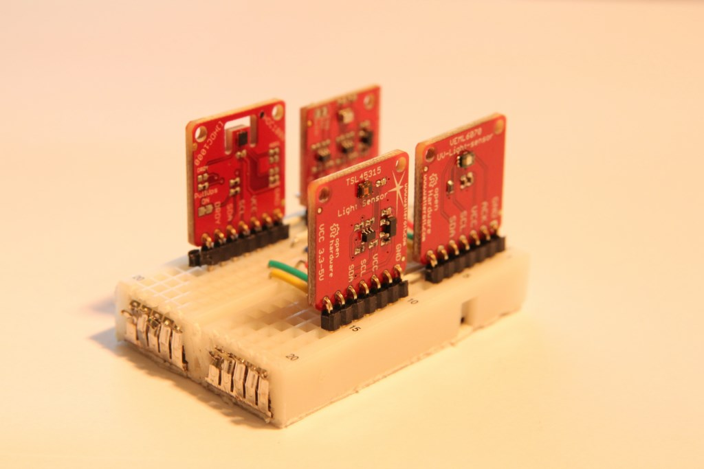
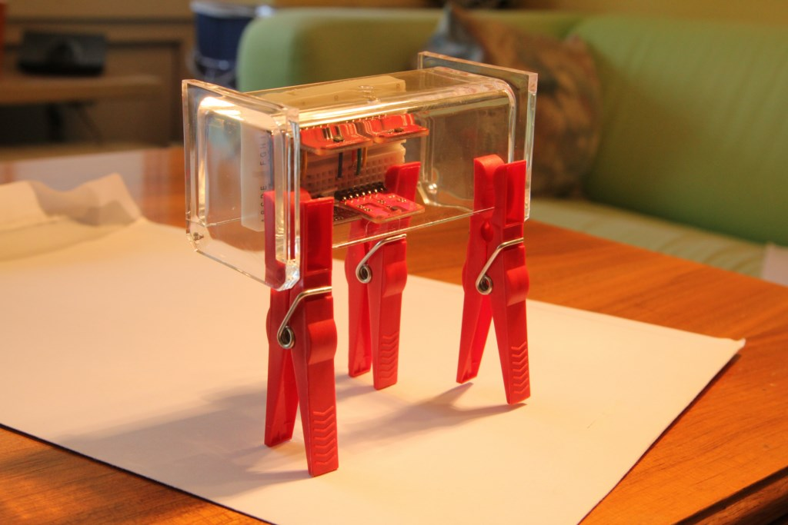
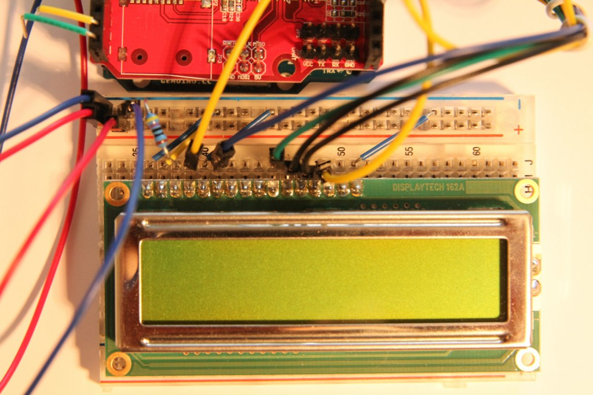
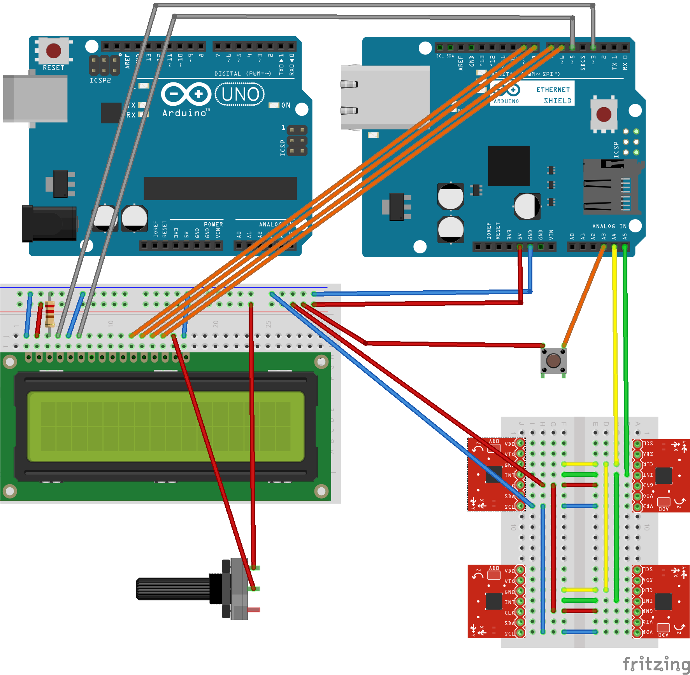
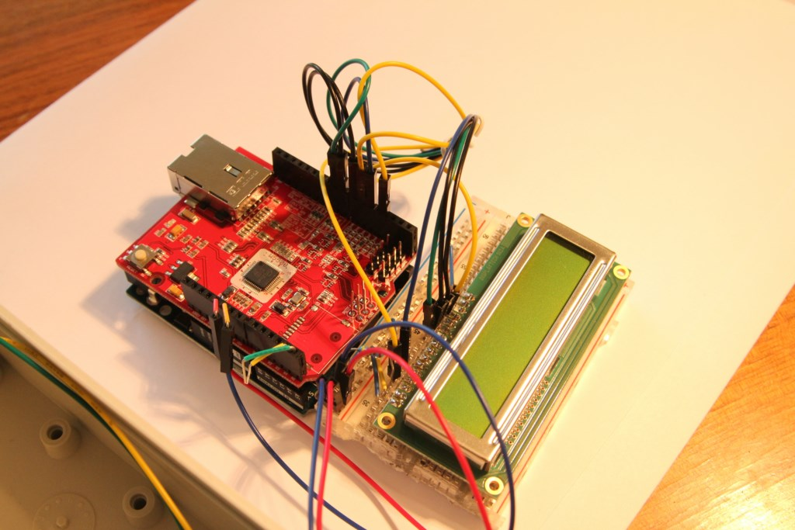
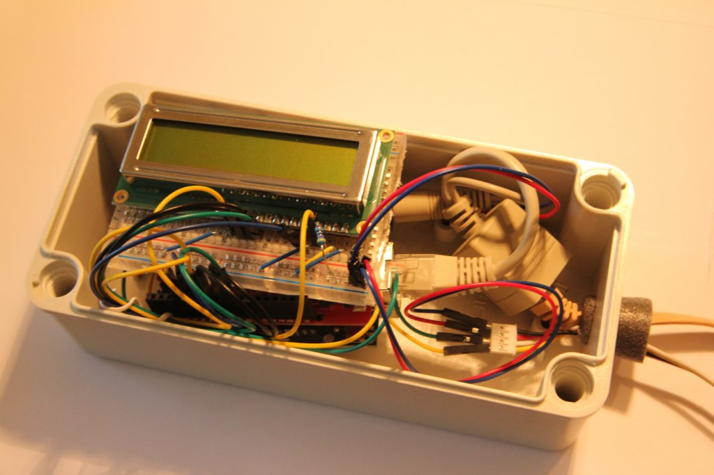
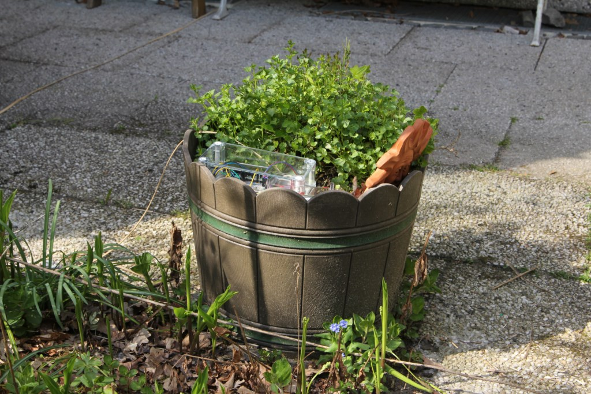
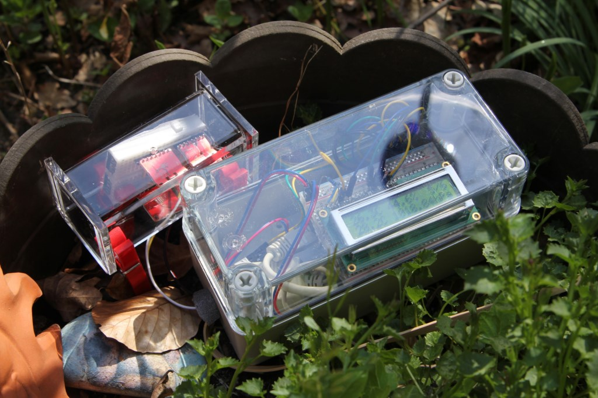

# senseBox:edu + LCD
Wir haben eine senseBox entwickelt, die nur in der senseBox:edu enthaltene Sensoren benutzt, dafür jedoch auch ein LCD zum sofortigen Ablesen der Messdaten aufweist.

## Ziel
Unsere senseBox kann die "Basis-Daten" der Wetterbeobachtung messen: Temperatur, Luftfeuchtigkeit und Luftdruck. Außerdem werden UV-Strahlung und die Helligkeit aufgezeichnet.

Das Besondere an dieser senseBox ist, dass die Messdaten über das Display direkt abgelesen werden können - ohne den "Umweg" über die OpenSenseMap.

Damit kann man das Wettergeschehen an seinem eigenen Wohnort beobachten, was für den interessierten Laien sehr attraktiv ist. Über die OpenSenseMap kann unsere senseBox dazu beitragen, mehr offene Daten zusammenzutragen. Insbesondere die Messung der UV-Strahlung ist aufgrund der wenigen offiziellen Messstellen interessant. Mit dem Helligkeitssensor wird "The Loss of Night" adressiert.

## Materialien
#### Aus der senseBox:edu
* Genuino UNO
* Temperatur- und Luftfeuchtigkeitssensor
* Barometer (mit zusätzlichem Temperatursensor)
* UV-Sensor
* Helligkeitssensor
* Ethernet-Shield
* Diverse Kabel, Widerstände etc.

#### Zusätzliche Hardware
* LCD von Displaytech, Modell 162A
* Breadboards
* Power-over-Ethernet-Kabel und Adapter
* Potentiometer
* senseBox-Gehäuse von Farnell (17x8cm)
* Sensoren-Gehäuse von ebelin/dm (10x4cm)

## Setup-Beschreibung
#### Hardwarekonfiguration
Die Sensoren befinden sich auf einem eigenen, zurechtgesägten Breadboard. Dieses wird in einem eigenen "Sensorhäuschen" untergebracht und per vieradrigem Kabel mit dem Hauptgehäuse verbunden. Dort befinden sich der Genuino Uno und das Display. Die Strom- und Internetversorgung erfolgt über ein Power-over-Ethernet-Flachbandkabel, das auch durch ein geschlossenes Fenster gelegt werden kann.





Die Verkabelung des Displays mit dem Genuino erwies sich als schwierig. Man benötigt zur Ansteuerung des Displays mindestens sechs digitale Ports. Das unvermeidbare Ethernet-Shield benutzt jedoch bereits viele der am Genuino zur verfügung stehenden Ports intern, sodass nur bestimmte zur weiteren Nutzung frei bleiben. Das ist bei der Verkabelung zu bedenken.



Verkabelung:







#### Softwaresketch
Die Ansteuerung der Sensoren erfolgt über die jeweils auf der Hersteller-Seite von Watterot verlinkten Bibliotheken, bzw. beim UV-Sensor über eine selbst programmierte Methode mithilfe der Wire-Bibliothek.

Links zu den zusätzlichen Bibliotheken:
* [HDC100X](https://github.com/RFgermany/HDC100X_Arduino_Library)
* [TSL45315](https://github.com/adidax/Makerblog_TSL45315)
* [BMP280](https://github.com/adafruit/Adafruit_BMP280_Library)

Da das Display einen zum Hitachi HD44780 kompatiblen Chipsatz benutzt, kann die bei der Arduino-IDE mitgelieferte LiquidCrystal-Bibliothek zur Ansteuerung genutzt werden. Hierbei ist wichtig, im Konstruktor die korrekte Verkabelung anzugeben.

Da das verwendete Display nur zwei Zeilen à 16 Spalten hat, können nicht alle Messdaten auf einmal ausgegeben werden. Dies wurde durch einen Umschalter gelöst, bei dessen Betätigung die sonst nicht zu sehenden Daten angezeigt werden. Aufgrund der oben beschriebenen Problematik mit den wenigen zur Verfügung stehenden digitalen Ports wurde dieser über einen analogen Port an den Genuino angeschlossen.

Code:

Initialisierung der Sensor-Objekte

``` c
// Temp & Humidity sensor
#include <HDC100X.h>
HDC100X temphumisensor = HDC100X(0x43);

// Light sensor
#include <Makerblog_TSL45315.h>
Makerblog_TSL45315 luxsensor = Makerblog_TSL45315(TSL45315_TIME_M4);

// Barometer sensor
// Using Adafruit library because mahfuz195's Arduino library doesn't work for some reason
#include <Adafruit_Sensor.h>
#include <Adafruit_BMP280.h>
#include <Wire.h>
#include <SPI.h>
#define BMP_SCK 13
#define BMP_MISO 12
#define BMP_MOSI 11 
#define BMP_CS 10
Adafruit_BMP280 bme;

// UV sensor
#define I2C_ADDR 0x38
#define IT_1_2 0x0 //1/2T
#define IT_1   0x1 //1T
#define IT_2   0x2 //2T
#define IT_4   0x3 //4T
```

LCD und Netzwerk:
``` c
// LCD
#include <LiquidCrystal.h>
// Using display in 4-bit mode
// The constructor takes the ports the LCD is wired to, in the following order: RS, Enable, Data Ports 4 to 7 
LiquidCrystal lcd(3, 5, 9, 8, 7, 6);

// Custom characters for display
byte smiley[8] = {
  B00000,
  B10001,
  B00000,
  B00000,
  B10001,
  B01110,
  B00000,
};
byte degree[8] = {
  B00111,
  B00101,
  B00111,
  B00000,
  B00000,
  B00000,
  B00000,
};

// remember if in offline mode
boolean online = true;

// The following comes directly from the SenseBox script

// Ethernet
#include <SPI.h>
#include <Ethernet.h>

//SenseBox ID
#define SENSEBOX_ID "xxxxxxxxxxxxxxxxxxxxxxxx"

//Sensor IDs
#define TEMPSENSOR_ID "xxxxxxxxxxxxxxxxxxxxxxxx"
#define HUMISENSOR_ID "xxxxxxxxxxxxxxxxxxxxxxxx" 
#define PRESSURESENSOR_ID "xxxxxxxxxxxxxxxxxxxxxxxx"
#define TEMPSENSOR2_ID "xxxxxxxxxxxxxxxxxxxxxxxx"
#define UVSENSOR_ID "xxxxxxxxxxxxxxxxxxxxxxxx"
#define LIGHTSENSOR_ID "xxxxxxxxxxxxxxxxxxxxxxxx" 

//Ethernet-Parameter
char server[] = "www.opensensemap.org";
byte mac[] = { 0xDE, 0xAD, 0xBE, 0xEF, 0xFE, 0xED };
// Diese IP Adresse nutzen falls DHCP nicht möglich
IPAddress myIP(192, 168, 0, 42);
EthernetClient client;

//Messparameter
int postInterval = 10000; //Uploadintervall in Millisekunden
long oldTime = 0;
```

Eigene Methoden:
``` c

// Own method for reading data from UV sensor using Wire library
float readUV()
{
  byte msb=0, lsb=0;
  float uv;

  Wire.requestFrom(I2C_ADDR+1, 1); //MSB
  delay(1);
  if(Wire.available()) msb = Wire.read();

  Wire.requestFrom(I2C_ADDR+0, 1); //LSB
  delay(1);
  if(Wire.available()) lsb = Wire.read();

  uv = (msb<<8) | lsb;
  uv = uv * 5.625;
  return uv;
}

// Helper method to output a quick info message on the LCD during setup 
void shortLCDmessage(String message)
{
  lcd.setCursor(0,1);
  lcd.print("                ");
  lcd.setCursor(0,1);
  lcd.print(message);
  delay(1000);
}
```

Setup:
``` c
void setup() {
  Serial.begin(9600);
  
  // LCD setup
  lcd.createChar(0, smiley);
  lcd.createChar(1, degree);
  lcd.begin(16, 2);

  // WELCOME MESSAGE
  lcd.print("Welcome to your");
  lcd.setCursor(0,1);
  lcd.print("sensebox:edu+LCD");
  delay(2000);

  lcd.clear();
  delay(1000);

  // SENSOR INITIALIZATION
  lcd.clear();
  lcd.print("Starting sensors");

  // Temp & Humidity Sensor setup
  shortLCDmessage("Temp sensor");
  temphumisensor.begin(HDC100X_TEMP_HUMI,HDC100X_14BIT,HDC100X_14BIT,DISABLE);

  // Light sensor setup
  shortLCDmessage("Light sensor");
  luxsensor.begin();

  // Barometer setup
  shortLCDmessage("Barometer");
  if (!bme.begin()) {  
    Serial.println(F("Could not find a valid BMP280 sensor, check wiring!"));
    while (1);
  }

  // UV sensor setup
  shortLCDmessage("UV sensor");
  Wire.begin();
  Wire.beginTransmission(I2C_ADDR);
  Wire.write((IT_1<<2) | 0x02);
  Wire.endTransmission();

  // Setup button
  pinMode(A3, INPUT);
  
  lcd.clear();
  delay(1000);
  
  // ETHERNET INITIALIZATION
  lcd.print("Starting network");
  shortLCDmessage("Trying DHCP");
    
  // Ethernet
  Serial.print("Starting network...");
  //Ethernet Verbindung mit DHCP ausführen..
  if (Ethernet.begin(mac) == 0) 
  {
    Serial.println("DHCP failed!");
    shortLCDmessage("DHCP failed");
    shortLCDmessage("Trying static IP");
    //Falls DHCP fehlschlägt, mit manueller IP versuchen
    Ethernet.begin(mac, myIP);
  }

  client.connect(server, 8000);
  if(!client.connected())
  {
    online = false;
    shortLCDmessage("Static IP failed");
    lcd.clear();
    delay(1000);
    lcd.print("Switching to");
    shortLCDmessage("LCD output only");
  }
  else
  {
    client.stop();
    online = true;
    shortLCDmessage("Connected");
  }
  
  Serial.println("done!");
  Serial.println("Starting loop.");

  lcd.clear();
  delay(1000);
  lcd.print("Ready! Waiting");
  lcd.setCursor(0,1);
  lcd.print("for 1st data set");
  delay(1000);
}
```

Loop:
``` c
void loop() {  
  if (millis() - oldTime >= postInterval)
  {
    oldTime = millis();
    
    // Read measurements from sensors and convert to String
    String temp = String(temphumisensor.getTemp(), 1);
    String humi = String(temphumisensor.getHumi(), 1);
    String lux = String(luxsensor.readLux());
    String temp2 = String(bme.readTemperature(), 1);
    String pres = String(bme.readPressure()/100);
    String alti = String(bme.readAltitude(1013.25));
    String uv = String(readUV(), 1);

    // Output measurements to LCD
    lcd.clear();
    lcd.print(temp + "C " + humi + "%");
    lcd.setCursor(0, 1);
    // Output light sensor or barometer data depending on whether button is pressed or not
    if(analogRead(A3) < 1000) lcd.print(temp2 + "C " + pres + "hPa"); else lcd.print(lux + "lux " + uv + "uW/cm2");
  
    // Output measurements to Serial Monitor
    String daten = temp + "," + humi + "," + lux + ',' + temp2 + ',' + pres + ',' + alti + ',' + uv;
    Serial.println(daten);

    // Post measurements to OpenSenseMap if network available
    if(online)
    {
      // Inform user on LCD about upload progress
      lcd.setCursor(13,0); lcd.print("1/6"); postStringValue(temp, 1, TEMPSENSOR_ID);
      lcd.setCursor(13,0); lcd.print("2/6"); postStringValue(humi, 1, HUMISENSOR_ID);
      lcd.setCursor(13,0); lcd.print("3/6"); postStringValue(pres, 1, PRESSURESENSOR_ID);
      lcd.setCursor(13,0); lcd.print("4/6"); postStringValue(temp2, 1, TEMPSENSOR2_ID);
      lcd.setCursor(13,0); lcd.print("5/6"); postStringValue(uv, 1, UVSENSOR_ID);
      lcd.setCursor(13,0); lcd.print("6/6"); postStringValue(lux, 1, LIGHTSENSOR_ID);
      lcd.setCursor(13,0); lcd.print("  ");  lcd.write(byte(0)); // smiley when done :)
    }
  }
}
```

Methoden zum Hochladen der Messdaten:
```
// Re-write of sensebox script's postFloatValue method (conversion to String is already done in loop so no need to do that here)
void postStringValue(String measurement, int digits, String sensorId)
{ 
  //Json erstellen
  String jsonValue = "{\"value\":"; 
  jsonValue += measurement; 
  jsonValue += "}";  
  //Mit OSeM Server verbinden und POST Operation durchführen
  Serial.println("-------------------------------------"); 
  Serial.print("Connectingto OSeM Server..."); 
  if (client.connect(server, 8000)) 
  {
    Serial.println("connected!");
    Serial.println("-------------------------------------");     
    //HTTP Header aufbauen
    client.print("POST /boxes/");client.print(SENSEBOX_ID);client.print("/");client.print(sensorId);client.println(" HTTP/1.1");
    client.println("Host: www.opensensemap.org"); 
    client.println("Content-Type: application/json"); 
    client.println("Connection: close");  
    client.print("Content-Length: ");client.println(jsonValue.length()); 
    client.println(); 
    //Daten senden
    client.println(jsonValue);
  }else 
  {
    Serial.println("failed!");
    Serial.println("-------------------------------------"); 
  }
  //Antwort von Server im seriellen Monitor anzeigen
  waitForServerResponse();
}

void waitForServerResponse()
{ 
  //Ankommende Bytes ausgeben
  boolean repeat = true; 
  do{ 
    if (client.available()) 
    { 
      char c = client.read();
      Serial.print(c); 
    } 
    //Verbindung beenden 
    if (!client.connected()) 
    {
      Serial.println();
      Serial.println("--------------"); 
      Serial.println("Disconnecting.");
      Serial.println("--------------"); 
      client.stop(); 
      repeat = false; 
    } 
  }while (repeat);
}
```

## OpenSenseMap Registrierung
Zur Registrierung unserer senseBox haben wir auf OpenSenseMap.org einen Account erstellt. Nachdem man seinen Namen, E-Mail-Adresse, Name und Aufstellungsort eingegeben hat, muss man mittels "manueller Konfiguration" die Sensoren der senseBox eintragen. Unter "Typ" steht dabei der Name des Sensors.

Nach Absenden des Formulars erhält man eine E-Mail mit einem Arduino-Sketch, den man zum Hochladen der Daten benutzen kann. Wir haben dessen Methoden in unser schon bestehendes Sensor-Auslese-Sketch eingepflegt.

## Stationsaufbau
Die Station wurde auf der Terasse eines Hauses in Münster-Kinderhaus aufgestellt. Der Standort zeigt Richtung Süden, ist recht sonnig, jedoch sehr windgeschützt.





Münster, im April 2016
