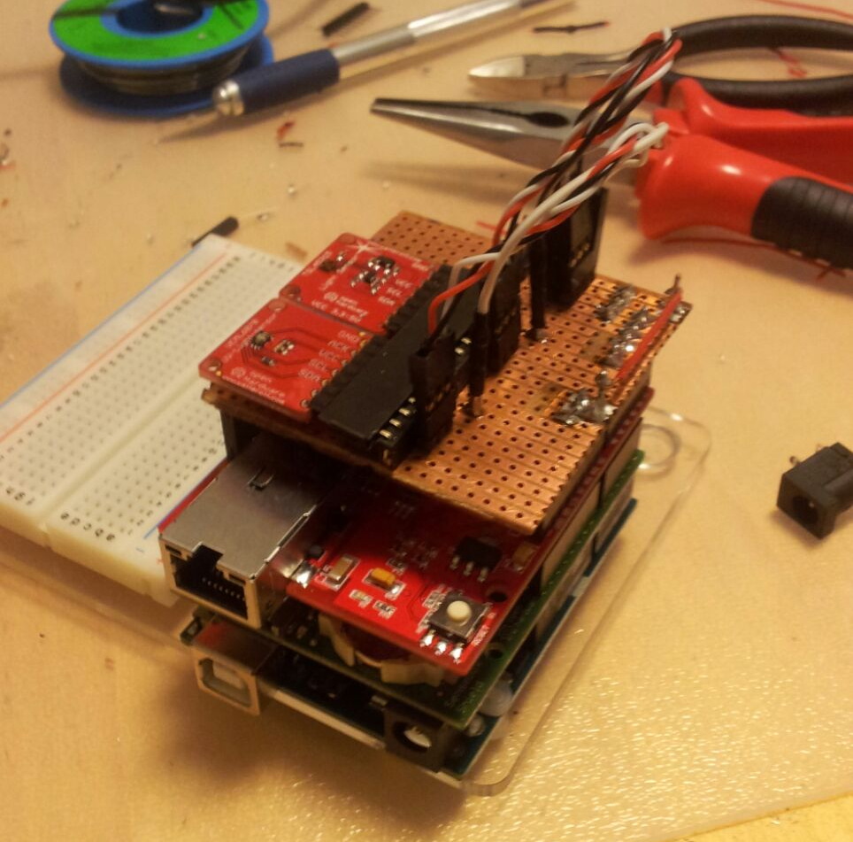
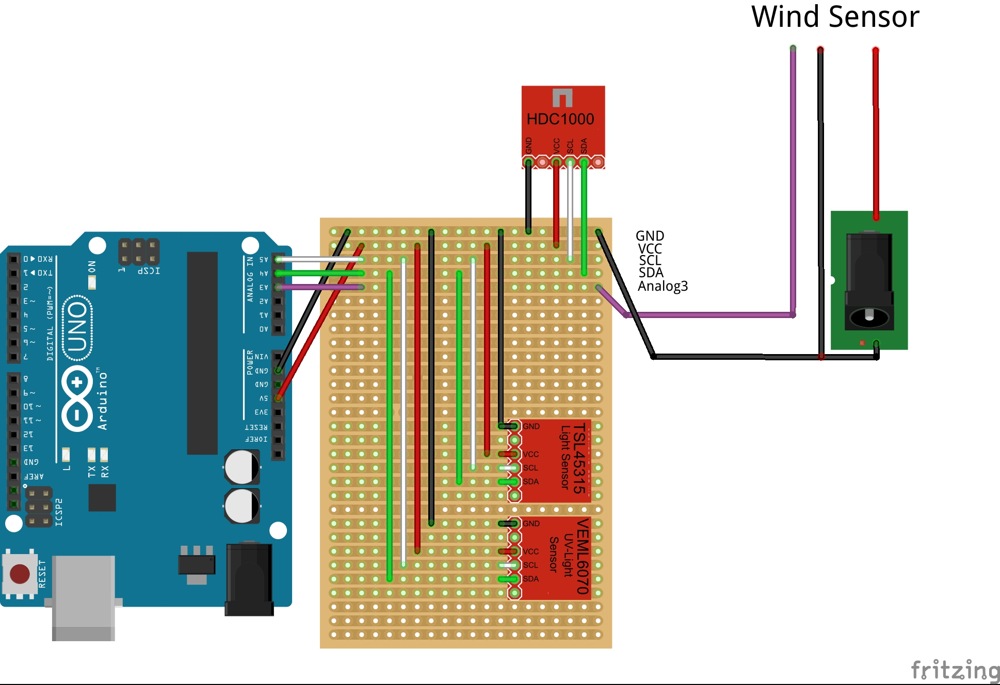
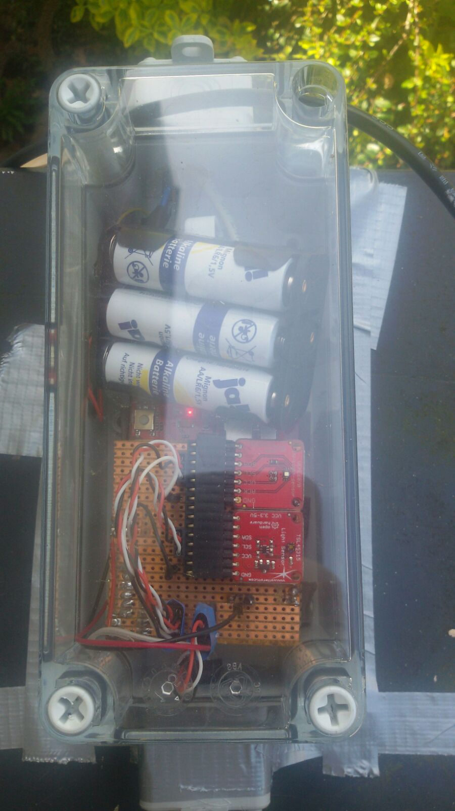
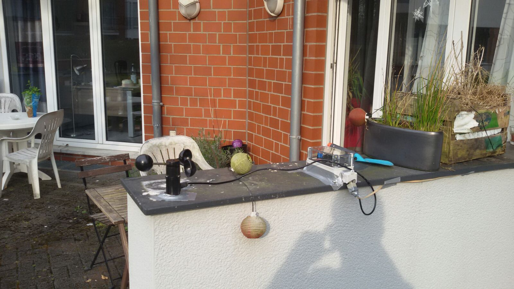

# Wetterstation mit Anenometer

> Autoren: [Specki](https://github.com/SpeckiJ) & Eric in einem Studienprojekt am [ifgi](http://ifgi.de), April 2016

In dieser senseBox werden Umweltdaten gemessen und an die openSenseMap übermittelt, die dadurch als Basis für verschiedene Karten dienen kann.
Die Station wird durch einen zusätzlichen Windmesser (Anenometer) ergänzt.

## Materialien
#### Aus der senseBox:edu
* Genuino UNO
* [HDC1000](http://www.watterott.com/de/HDC1008-Breakout) (Temperatur&Luftfeuchtigkeitssensor)
* [VEML6070](http://www.watterott.com/de/VEML6070-Breakout-UV-Lichtsensor) (UV-Lichtsensor)
* [TSL45315](http://www.watterott.com/en/TSL45315-Breakout) (Lichtsensor)

#### Zusätzliche Hardware
* [Anemometer](https://www.adafruit.com/products/1733?&main_page=product_info&products_id=1733) (Windsensor)
* Kupferplatine
* diverse Kabel
* Ethernet-Kabel
* Power-over-Ethernet Adapter

## Setup
#### Hardwarekonfiguration
Auf das Genuino/Uno ist das WIZnet Ethernet Shield gesteckt um Netzwerk und Stromverbindung zu ermöglichen. Zusätzlich haben wir das Board um eine Kupferplatine erweitert um UV und Lichtsensoren horizontal ausgerichtet zu befestigen, damit korrekte Messdaten ermittelt werden können. Während sich die oben genannten Sensoren innerhalb der Wetterfest-Box befinden, sind Temperatursensor und Anemometer außerhalb der Box installiert um die Messdaten nicht zu verfälschen. Über ein Ethernet-Kabel werden die Messdaten in einem vorgegebenen Intervall an die openSenseMap übermittelt.
Die Stromversorgung der gesamten Box wird über einen Power-over-Ethernet Adapter realisiert.

Improvisiertes Shield für den Arduino:



Das improvisierte Shield für den Arduino basiert auf einer einfachen einseitigen Streifenrasterplatine. Da fast alle Sensoren über I2C ausgelesen werden, wurden die für I2C benötigten Pins (GND,VCC,SCL,SDA) direkt nebeneinander gelegt. Dies ermöglicht es, mit einem einzelnen Kabel mit 3er-Stecker die auf den Sensoren direkt nebeneinanderliegenden Anschlüsse VCC,SCL,SDA direkt anzuschließen. Zusätzlich wird noch ein einzelnes Kabel für GND benötigt. Durch die Verwendung der 3er-Stecker sinkt die Anzahl der benötigten Kabel auf zwei, was hilft die gesamte Schaltung übersichtlich zu halten.
Schaltplan:


In dem Schaltplans wurde auf Grund der Übersichtlichkeit auf die 3er-Stecker verzichtet (Kabelstränge würden dauerhaft überlappen -> Schaltung nicht mehr klar zu erkennen). Stattdessen sind die Anschlüsse zu den Sensoren durch 3 parrallele einzelne Kabelverbindungen dargestellt.

Das Anemometer gibt die Windgeschwindigkeit als analoges Stromsignal zwischen 0,4V und 2V über das Violett eingezeichnete Kabel wieder. Das Anemometer benötigt eine eigene Stromversorgung von 9-25V. Diese wird von einer zusätzlichen Batteriebox innerhalb der senesBox gewährleistet.

__Wichtig__ in dem Schaltplan zu beachten ist zudem, dass der Minuspol der zusätzlichen Stromversorgung mit dem Minuspol des Arduino verbunden ist! Ist dies nicht der Fall, ist es für den Arduino unmöglich die Spannungsschwankungen auf dem Signalkabel des Anemometers zu erkennen!

Fertig zusammengebaute Box mit zusätzlicher integrierter Stromversorgung:

#### Softwaresketch

Der Softwaresketch basiert auf der von der openSenseMap bereitgestellten Schablone.

Neben dem eigentlichen Lesen der konkreten Sensorwerte werden zusätzlich verschiedene Umrechnungen direkt im Programmcode realisiert.
Da das Anemometer die Windgeschwindigkeit über ein analoges Stromsignal wiedergibt (mehr Strom = höhere Windgeschwindigkeit) ist eine Umrechnung von Volt zu Windgeschwindigkeit(m/s) implementiert worden.
Auch bei der UV-Intensität muss eine ähnliche Umrechnung stattfinden um das gewünschte Endergebnis zu erhalten (µW/cm²).
Die restlichen Sensoren geben direkt nutzbare Werte aus und werden daher direkt hochgeladen.

Links zu zusätzlichen Bibliotheken die für einige der Sensoren/Shields benötigt werden

* [HDC1000 Bibliothek](https://github.com/RFgermany/HDC100X_Arduino_Library)
* [Ethernet Bibiliothek](https://github.com/Wiznet/WIZ_Ethernet_Library)


Programmcode:
``` c
#include <SPI.h>
#include <Ethernet.h>

/*
 * Zusätzliche Sensorbibliotheken, -Variablen etc im Folgenden einfügen.
 */
#include <Wire.h>
#include <HDC100X.h>

//SenseBox ID
#define SENSEBOX_ID "XXXXXXXXXXXXXXXXXXXXXXXX"

//Sensor IDs und MAC-Addressen wurden zensiert 
#define SENSOR1_ID "XXXXXXXXXXXXXXXXXXXXXXXX" // Luftfeuchtigkeit 
#define TEMPSENSOR_ID "XXXXXXXXXXXXXXXXXXXXXXXX"
#define UVSENSOR_ID "XXXXXXXXXXXXXXXXXXXXXXXX"
#define SENSOR2_ID "XXXXXXXXXXXXXXXXXXXXXXXX" // Licht 
#define SENSOR3_ID "XXXXXXXXXXXXXXXXXXXXXXXX" // Wind (Anemometer)

``` 

Im folgenden werden Variablen für die internen Umrechnungen deklariert
``` c
// I2C Variablen Lichtsensor
#define I2C_ADDR_LUX        (0x29)
#define REG_CONTROL_LUX     0x00
#define REG_CONFIG_LUX      0x01
#define REG_DATALOW_LUX     0x04
#define REG_DATAHIGH_LUX    0x05
#define REG_ID_LUX          0x0A

// I2C Variablen UV-Sensor
#define I2C_ADDR_UV (0x38)
//Integration Time
#define IT_1_2 0x0 //1/2T
#define IT_1   0x1 //1T
#define IT_2   0x2 //2T
#define IT_4   0x3 //4T

// Initialisierung des Temp/Humi Sensors
HDC100X hdc_temp_humi(0x43);

// Analogpin Windsensor
const int analogSensorPin = A3;

``` 
Netzwerkeinstellungen:
``` c
//Ethernet-Parameter
char server[] = "www.opensensemap.org";
byte mac[] = { XXXX, XXXX, XXXX, XXXX, XXXX, XXXX };
// Diese IP Adresse nutzen falls DHCP nicht möglich
IPAddress myIP(XXXX, XXXX, XXXX, XXXX);
EthernetClient client;

//Messparameter
int postInterval = 10000; //Uploadintervall in Millisekunden
long oldTime = 0;

void setup()
{
  Serial.begin(9600);
```
Netzwerksetup wurde aus der von openSenseMap bereitgestellten Schablone übernommen:
``` c
  Serial.print("Starting network...");
  //Ethernet Verbindung mit DHCP ausführen..
  if (Ethernet.begin(mac) == 0)
  {
    Serial.println("DHCP failed!");
    //Falls DHCP fehltschlägt, mit manueller IP versuchen
    Ethernet.begin(mac, myIP);
  }
  Serial.println("done!");
  delay(1000);
  Serial.println("Starting loop.");

  // Analoger Windsensor Pin
  pinMode(analogSensorPin , INPUT);
}

void loop()
{
  //Upload der Daten mit konstanter Frequenz
  if (millis() - oldTime >= postInterval)
  {
    oldTime = millis();
``` 
Die Sensoren werden der Reihenfolge nach ausgelesen.
Lichtsensor wird erst über I2C gestartet und daraufhin die Belichtungszeit festgelegt. Anschließend werden 2 Bytes von dem Lichtsensor angefordert. Diese enthalten 
``` c
    // SENSOR 1: Lichtsensor
    // Starten des Lichtsensors
    Wire.begin();
    Wire.beginTransmission(I2C_ADDR_LUX);
    Wire.write(0x80 | REG_CONTROL_LUX);
    Wire.write(0x03); //Power on
    Wire.endTransmission();
    // Festlegen der Belichtungszeit
    Wire.beginTransmission(I2C_ADDR_LUX);
    Wire.write(0x80 | REG_CONFIG_LUX);
    Wire.write(0x01); //400 ms Belichtungszeit
    Wire.endTransmission();
```
Der Sensor liefert zwei Bytes mit einem high/low Wert. Diese werden lokal gespeichert um die einfache Umrechnung zu ermöglichen.
``` c
    Wire.beginTransmission(I2C_ADDR_LUX);
    Wire.write(0x80 | REG_DATALOW_LUX);
    Wire.endTransmission();
    Wire.requestFrom(I2C_ADDR_LUX, 2); //2 Bytes anfordern

    uint16_t low = Wire.read();
    uint16_t high = Wire.read();

    while (Wire.available()) {
      Wire.read();
    }
``` 
Umrechnung von high/low Bytes zu Lux wurde aus dem SenseBox-Wiki übernommen.
``` c
    uint32_t lux; //Umrechnung für Lux vom Sensebox-Wiki
    lux = (high << 8) | (low << 0);
    lux = lux * 2; //Multiplikator für 400ms

    // 131070 is Error value if Sensor is not connected! Fehlerbehebung! 
    if (lux != 131070) {
      postFloatValue(lux, 1, "XXXXXXXXXXXXXXXXXXXXXXXX");
    } else {
      Serial.println("Light Sensor not connected/not working!");
    }
    // Ende von SENSOR 1

```
Temperatur/Luftfeuchtigkeitssensor wird gestartet. Falls der Temperatursensor inkorrekt angeschlossen oder defekt ist, liefert er einen inkorrekten Messwert von etwa -40. Da dieser Messwert klar als irregulär erkannt werden kann, da er im Einsatzgebiet dieser SenseBox nicht vorkommt(Mitteleuropäisches Klima), wird eine Fehlermeldung an den Seriellen Port geschickt und auf das Hochladen der Daten verzichtet.   
``` c
    // SENSOR 2: Temperature/Humidity Sensor
    hdc_temp_humi.begin(HDC100X_TEMP_HUMI, HDC100X_14BIT, HDC100X_14BIT, DISABLE);

    // Error value if Sensor is not connected is about -40!
    if (hdc_temp_humi.getTemp() > -35) {
      postFloatValue(hdc_temp_humi.getTemp(), 1, "XXXXXXXXXXXXXXXXXXXXXXXX");
    } else {
      Serial.println("Humidity/Temperature Sensor not connected/not working!");
    }
``` 
Analog zu der Fehlererkennung bei dem Temperatursensor, werden auch bei dem Luftfeuchtigkeitssensor Daten die offensichtlich nicht der Realität entsprechen (Luftfeuchtigkeit von weniger als 0,5%) nicht an die openSenseMap übertragen.
``` c
    // Error value if Sensor is not connected is about 0.4!
    if (hdc_temp_humi.getHumi() > 0.5) {
      postFloatValue(hdc_temp_humi.getHumi(), 1, "XXXXXXXXXXXXXXXXXXXXXXXX");
    } else {
      Serial.println("Humidity/Temperature Sensor not connected/not working!");
    }
    // Ende von SENSOR 2

```
Das Auslesen des UV-Sensors wurde aus dem Anwendungsbeispiel des Sensors von der offiziellen Herstellerseite übernommen. Weitere Informationen [hier](https://github.com/watterott/VEML6070-Breakout). Wieder wurde eine einfache Fehlererkennung implementiert (UV-Sensor gibt '3' aus wenn defekt).
``` c
    // SENSOR 4 : UV-Sensor
    // Umrechnung vom Hersteller übernommen
    Wire.beginTransmission(I2C_ADDR_UV);
    Wire.write((IT_1 << 2) | 0x02);
    Wire.endTransmission();

    byte msb = 0, lsb = 0;
    uint16_t uv;

    Wire.requestFrom(I2C_ADDR_UV + 1, 1); //MSB
    delay(1);
    if (Wire.available())
      msb = Wire.read();

    Wire.requestFrom(I2C_ADDR_UV + 0, 1); //LSB
    delay(1);
    if (Wire.available())
      lsb = Wire.read();

    uv = (msb << 8) | lsb;

    if (uv != 3) { //Fehlerbehebung!
      postFloatValue(uv * 5.625, 1 , "XXXXXXXXXXXXXXXXXXXXXXXX");
    } else {
      Serial.println("UV Sensor not connected/not working!");
    }
    // Ende von SENSOR 4
``` 
Die Umrechnung von der 0-1023 Skala der analogRead() Funktion des Arduino zu m/s Windgeschwindigkeit wurde übernommen. Genauere Erklärung zu der Umrechnung in den Inline-Kommentaren.
``` c
    // SENSOR 5: Wind
    /*
     *  Code taken from : http://www.hackerscapes.com/2014/11/anemometer/
     *
     *  All credits belong to their respectful owners.
     *  Edited on 07.04.2016 by Specki
     */
     
    int sensorValue = 0; //Variable stores the value direct from the analog pin
    float sensorVoltage = 0; //Variable that stores the voltage (in Volts) from the anemometer being sent to the analog pin
    float windSpeed = 0; // Wind speed in meters per second (m/s)

    float voltageConversionConstant = .004882814; //This constant maps the value provided from the analog read function, which ranges from 0 to 1023, to actual voltage, which ranges from 0V to 5V
    int sensorDelay = 1000; //Delay between sensor readings, measured in milliseconds (ms)

    //Anemometer Technical Variables
    //The following variables correspond to the anemometer sold by Adafruit, but could be modified to fit other anemometers.

    float voltageMin = .4; // Mininum output voltage from anemometer in mV.
    float windSpeedMin = 0; // Wind speed in meters/sec corresponding to minimum voltage

    float voltageMax = 2.0; // Maximum output voltage from anemometer in mV.
    float windSpeedMax = 32; // Wind speed in meters/sec corresponding to maximum voltage

    sensorValue = analogRead(analogSensorPin); //Get a value between 0 and 1023 from the analog pin connected to the anemometer

    sensorVoltage = sensorValue * voltageConversionConstant; //Convert sensor value to actual voltage

    //Convert voltage value to wind speed using range of max and min voltages and wind speed for the anemometer
    if (sensorVoltage <= voltageMin) {
      windSpeed = 0; //Check if voltage is below minimum value. If so, set wind speed to zero.
    } else {
      windSpeed = (sensorVoltage - voltageMin) * windSpeedMax / (voltageMax - voltageMin); //For voltages above minimum value, use the linear relationship to calculate wind speed.
    }

    //Print windspeed to serial
    postFloatValue(windSpeed, 1 , "XXXXXXXXXXXXXXXXXXXXXXXX");
    // Ende von SENSOR 5
  }
}
``` 
Routinen zum Upload der Messdaten wurde aus der von der openSenseMap bereitgestellten Schablone übernommen.
``` c
void postFloatValue(float measurement, int digits, String sensorId)
{
  //Float zu String konvertieren
  char obs[10];
  dtostrf(measurement, 5, digits, obs);
  //Json erstellen
  String jsonValue = "{\"value\":";
  jsonValue += obs;
  jsonValue += "}";
  //Mit OSeM Server verbinden und POST Operation durchführen
  Serial.println("-------------------------------------");
  Serial.print("Connectingto OSeM Server...");
  if (client.connect(server, 8000))
  {
    Serial.println("connected!");
    Serial.println("-------------------------------------");
    //HTTP Header aufbauen
    client.print("POST /boxes/"); client.print(SENSEBOX_ID); client.print("/"); client.print(sensorId); client.println(" HTTP/1.1");
    client.println("Host: www.opensensemap.org");
    client.println("Content-Type: application/json");
    client.println("Connection: close");
    client.print("Content-Length: "); client.println(jsonValue.length());
    client.println();
    //Daten senden
    client.println(jsonValue);
  } else
  {
    Serial.println("failed!");
    Serial.println("-------------------------------------");
  }
  //Antwort von Server im seriellen Monitor anzeigen
  waitForServerResponse();
}

void waitForServerResponse()
{
  //Ankommende Bytes ausgeben
  boolean repeat = true;
  do {
    if (client.available())
    {
      char c = client.read();
      Serial.print(c);
    }
    //Verbindung beenden
    if (!client.connected())
    {
      Serial.println();
      Serial.println("--------------");
      Serial.println("Disconnecting.");
      Serial.println("--------------");
      client.stop();
      repeat = false;
    }
  } while (repeat);
}

```

## openSenseMap Registrierung
Die Station wurde auf der openSenseMap unter dem Namen "Wetterstation Specki & Eric " registriert. Es wurden insgesamt 5 Sensoren angegeben: 
* Lichtintensität (in Lux)
* UV-Intensität(µW/cm²)
* Temperatur(°C)
* Windgeschwindigkeit (m/s)
* Luftfeuchtigkeit(%)

Die Box kann direkt unter der Adresse * [Wetterstation Specki & Eric](http://opensensemap.org/#/explore/57062d7345fd40c81974691c) erreicht werden.

## Stationsaufbau
Die Station wird am Michaelweg, 48149 Münster in einem Garten aufgestellt. Das Anemometer befindet sich in möglichst offener Lage, sodass die Messdaten möglichst wenig verfälscht werden. Auch der Temperatur/Feuchtigkeitssensor befindet sich außerhalb der Box, damit die Daten möglichst wenig verfälscht werden. Licht/UV-Sensor befinden sich innerhalb der Box.

Platzierung der Box:

