_DIGITAL CITIZENS, CONNECTED COMMUNITIES:_

_THE ROLE OF SPATIAL COMPUTING AND VOLUNTEERED GEOGRAPHIC INFORMATION_

__TUTORIAL: “MOBILE SENSOR LOGGER”__


Authors: Michelle Gybel and Johannes Schöning of Hasselt University

Edited by Felix Erdmann using _pandoc_


This tutorial is a step-by-step guide which will teach you how to build
mobile sensor logging device using the senseBox Edu kit.

Preparation
===========

1.  Install Arduino

  -   Download from [here](https://www.arduino.cc/en/Main/Software)

  -   (Extra:) **Tutorials** and **Reference Guides** can be found [here](https://www.arduino.cc/en/Guide/HomePage)

1.  Install senseBox Plugins

  -   Download from [here](https://github.com/senseBox/resources/raw/master/libraries/senseBox_Libraries.zip)

  -   Extract the folder and copy the content to the `libraries/` folder in Arduino’s installation files.

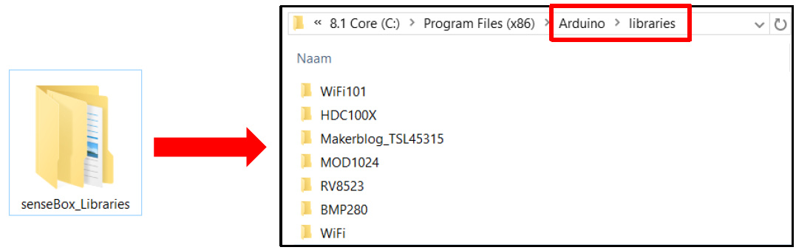

Start with the basics… How to Push a button!
============================================

1.  What do you need?

  -   Genuino Board with breadboard __(A)__

  -   10K ohm resistor __(B)__

  -   Wires __(C)__

  -   Pushbutton (switch) __(D)__

    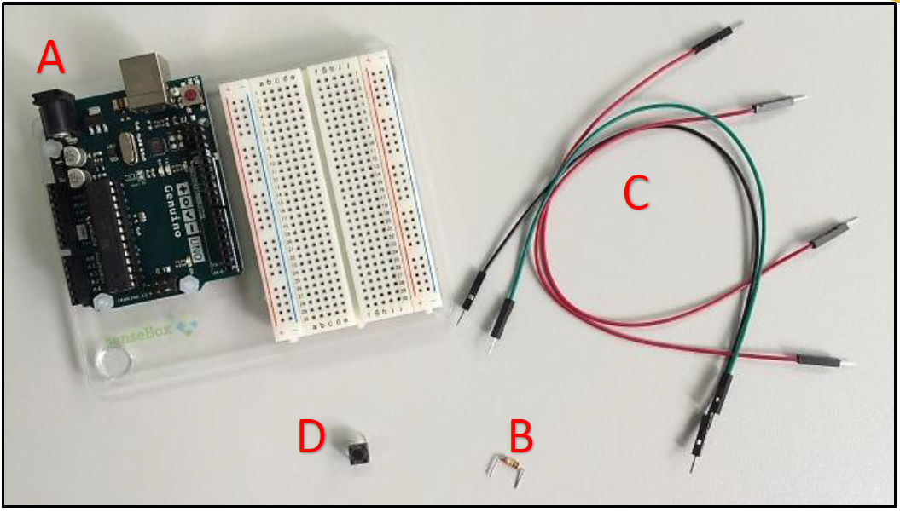

1.  Provide voltage and grounding to the breadboard

  -   Connect a red wire to the positive vertical row of the breadboard and to the 5 volt supply on the Genuino Board **(A)**.

    -   Connect a black wire to the negative vertical row of the breadboard and to the ground (GND) on the Genuino Board **(B)**.

    
    

1.  Add the pushbutton and provide it with power and grounding

  -   Attach the **pushbutton** to the *breadboard* as presented below **(A)**.

    -   Create a connection between one of the legs of the pushbutton and the ground with the **10K ohm resistor** **(B)**.

    -   Connect a red wire to the **positive** vertical row of the *breadboard* **(C)**.

    

<!-- -->

  -   Provide with a green wire a connection between digital pin 2 on the Genuino Board and the leg of pushbutton connected to the ground.

    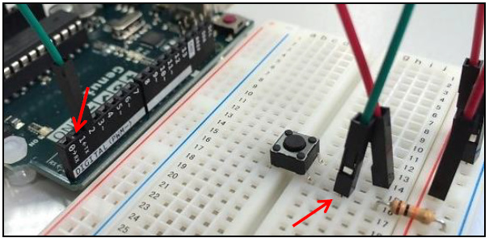


1.  Turn on the light, ähm button… by writing some code

  -   Start the Arduino IDE.

  -   Programs written in the IDE are called sketches. Go to File New and name the file Pushbutton.ino or similar to create your first sketch.

    

  -   Each sketch must contain a setup() and a loop() function:

    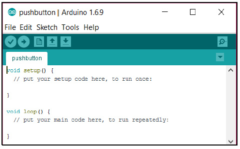


<!-- -->

  -   As a start you can may place the following code in your sketch. It initializes the which pins are connected to the LED light on the Genuino Board and the push button. Next, it provides the functionality to turn the LED light on when the button is pressed in. This LED is built-in in the Genuino board and driven by pin 13.

    


  ```arduino

  const int buttonPin = 2; // the number of the pin to which the pushbutton is connected

  const int ledPin = 13; // the number of the pin connected to the LED

  int buttonState = 0; // variable for reading the status of the pushbutton

  void setup() {

    pinMode(buttonPin, INPUT); // initialize the pushbutton pin as an input

    pinMode(ledPin, OUTPUT); // initialize the LED pin as an output

  }

  void loop() {

    buttonState = digitalRead(buttonPin); // get the value of the pushbutton

    //check if the pushbutton is pressed in

    if (buttonState == HIGH){

    digitalWrite(ledPin, HIGH); // if the button is pushed, turn LED on

    } else {

    digitalWrite(ledPin, LOW); // if the button is released, turn LED off

    }

  }
  ```


1.  Compile and upload the sketch to the board

  -   Connect the board to your computer with a USB cable.

    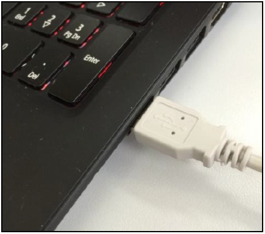
    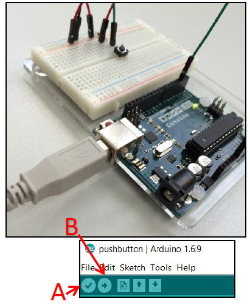

    -   Compile the code by clicking on the Verify button __(A)__.

    -   Click on the Upload button __(B)__.

    

1.  Test your program
  * Push the button on the board.
  * A LED light on the Genuino Board should light up.

    

Let’s build the Sensor Data logger
===================================

1.  What do you need?

  -   Your “Push-a-button” construction (A)

  -   HDC1008 Temperature and Humidity Sensor (B)

  -   Extra wires (C)

    

1.  Connect the sensor and provide it with power and grounding

  -   Connect the **sensor** to the *breadboard*.

    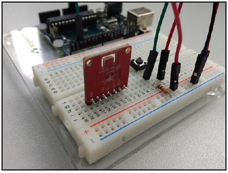

    -   The labels on the sensor mark tell which pins need to be connected
    to the power and ground. If you are unsure, please consult the data
    sheet for your sensor.

    -   Connect a yellow wire to the positive vertical row and to the VCC
    pin of the sensor (A).

    -   Connect a black wire to the negative vertical row and to the GND pin
    of the sensor (B).

    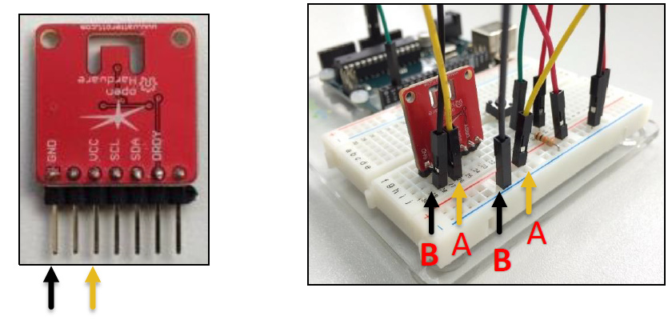

1.  Create a connection between the sensor and the microcontroller to
    transmit measurements

    -   Provide with a blue wire a connection between the **analog pin AV4**
    (you may also connect to another free analog pin; then check if you
    address the sensor in your code correctly) on the *Genuino Board*
    and the **SDA** **pin** of the sensor.

  -   Provide with a green wire a connection between the **analog pin
    AV5** (you may also connect to another free analog pin; then check
    if you address the sensor in your code correctly) on the *Genuino
    Board* and the **SCL** **pin** of the sensor.

    
    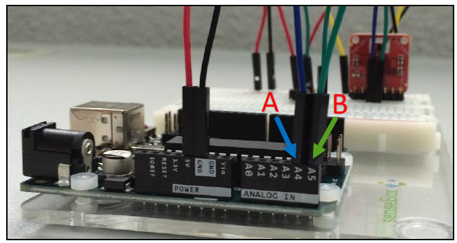

Write the program for the Weather Station
=========================================

1.  Create a new sketch

  -   Start the Arduino IDE.

  -   Go to File New and name the file PushbuttonTemperature.ino to create
    your own sketch.

1.  Include the required libraries

  -   Add the following code to your program to add two libraries:

      -   Wire.h provides functions to communicate with the data
          line (SDA) pin and clock line (SCL) pin.

      -   HDC100X.h makes communication and actions with the SD
          card possible.

          `#include <Wire.h>;`

          `#include <HDC100X.h>;`

1.  Define global variables

  -   Create a connection with the sensor and pushbutton.

  -   Define variables for the button state and id.

```arduino
    HDC100X HDC1(0x43); // create a connection to the sensor on address 0x43

    int buttonPin = 2; // the number of the pin to which the pushbutton
    // is connected, change this if you
    // connected the button to a different port

    int buttonState = 0; // variable for reading the status of the pushbutton

    int lastButtonState = 0; // previous state of the pushbutton

    int id = 0; // count for how many times the button has been pressed
    // and set this as ID
    ```

1.  Write the setup() function

  -   Start the sensor.

  -   Initialize the pushbutton as an input.
      ```arduino
      void setup() {

        Serial.begin(9600); // provide communication with the
        // computer with data rate 9600 bits per second

        HDC1.begin(HDC100X\_TEMP\_HUMI, HDC100X\_14BIT, HDC100X\_14BIT,
        DISABLE); // start the sensor

        pinMode(buttonPin,INPUT); // initialize the pushbutton pin
        // as an input

      }
      ```

1.  Write the loop() function

  -   Read the value from the push button.

  -   If the button is pressed, measure the temperature and print it to the console.

    ```arduino
    void loop() {

      buttonState = digitalRead(buttonPin); // read value from push button

      // if button is pressed in

      if (buttonState != lastButtonState && buttonState == HIGH) {

      id++; // update id

      Serial.print("ID: "); // print the id to the console

      Serial.println(id);

      Serial.print("Temperature: "); // get the temperature and
      // print it to the console

      Serial.println(HDC1.getTemp());

      Serial.print("\\n");

      }

      lastButtonState = buttonState; // set current state as last button state

    }
    ```

1.  Run your program

  -   Compile your program and upload it to the board (A).

  -   Click on the Serial Monitor button. The COM1 dialog should pop up (B).

  -   Push the button on your board. A new result should appear on your screen (C).

    

Write the results to a file on a SD card
========================================

1.  What do you need?

  -   Your Arduino construction from the previous steps.

  -   A senseBox Shield with SD card slot.

  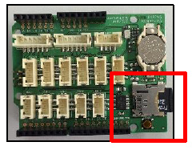


1.  Connect the senseBox Shield to the Genuino Board

  -   Since the senseBox Shield will be placed on top of the Genuino
    Board, the wires need to be connected to the senseBox Shield.

    

    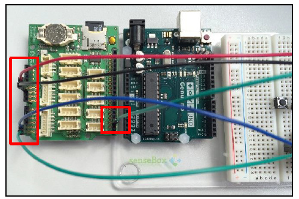

-   Place the **senseBox Shield** on the **Genuino Board**.

    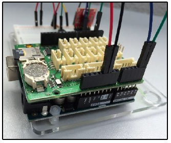

1.  Adjust your program

  -   Open the file PushbuttonTemperature.ino in the Arduino IDE.

  -   Add a library for SD card functionalities:

    `#include <SD.h>`

<!-- -->

-   Define a global variable which contains the identifier of the pin connected to the SD card.

    `int chipPin = 4; // pin connected to the SD card`

    -   Initialize the SD card in the **setup()** function.

    `SD.begin(chipPin); // initialize the SD card.`

    -   Adjust the loop() function.

    ```arduino
    void loop() {

      buttonState = digitalRead(buttonPin); // read value from push button

      // if button is pressed in

      if (buttonState != lastButtonState && buttonState == HIGH) {

        id++; // update id

        File file = SD.open("temp.csv", FILE\_WRITE); // open a file named temp.csv

        file.print(id); // print the id to the file

        file.print(";");

        file.print(HDC1.getTemp()); // get the temperature and print it to the file

        file.print("\\n");

        file.close(); // close the file

      }

      lastButtonState = buttonState; // set current state as last button state

    }
    ```

1.  Run your program

  -   Place the SD card in the slot on the senseBox Board (A).

  -   Compile your program and upload it to the board (B).

  -   Push the button on the breadboard multiple times (C).

    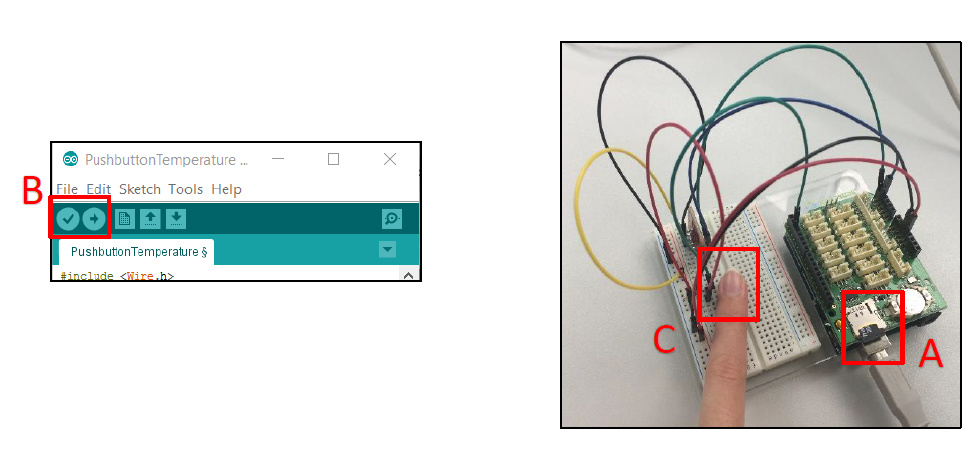

1.  View the results

  -   Place the SD card in the card reader slot of your computer.

  - Open the file TEMP.CSV.

  - You can now see the resulting temperature measurements.


Make it mobile
===============


Time to go on a field study and measure the temperatures throughout the building and surroundings. You can make your Arduino weather station more mobile by attaching a battery to the *Genuino Board*. Good luck during your expedition!
