**Digital Citizens, Connected Communities:**

**The Role of Spatial Computing and Volunteered Geographic Information**

Tutorial: Create a heat map in QGIS

Edited by Felix Erdmann using _pandoc_

The field measurements you have acquired with your DIY weather station
can be used to generate a thematic map. Since the measurements consist
of temperature data a heat map is the most visualization type for that.
In this tutorial you will learn how to visualize your data as a heat map
in QGIS.

Preparation
===========

1.  Install QGIS

  -   <http://www.qgis.org/nl/site/index.html>

  -   (Extra:) **Documentation** and a **QGIS Training Manual** can be
      found here:\
      <http://www.qgis.org/en/docs/index.html>

1.  Install Plugins

  -   Open QGIS.

  -   Go to **Plugins** **Manage and Install Plugins…**

   

  -   Search for **Interpolation Plugin (A)**. Select **Install
      Plugin (B)** if this option is still available.

  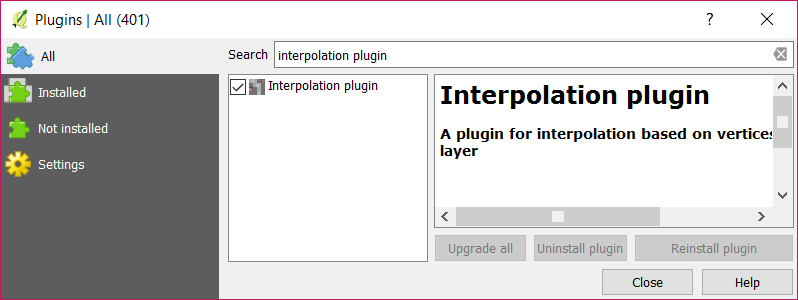
  -   Search for **QuickMapService** **(A)** and select **Install
      Plugin (B)**.

Import the data
===============

1.  

Create a new project

  -   Go to Project New.

  -   Save your project as CampusHeatMap.qgs.

1.  Get OpenStreetMap data

  -   Go to Web QuickMapServices OSM OSM Mapnik.

    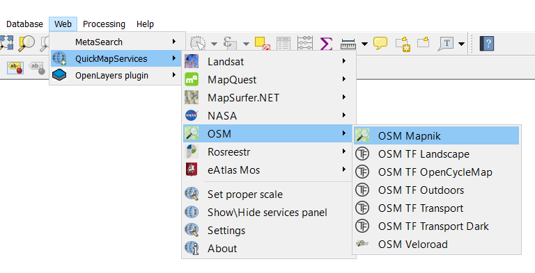

  -   Open the layer OSM Mapnik and navigate to Campus Diepenbeek by using
    the Pan tool.

    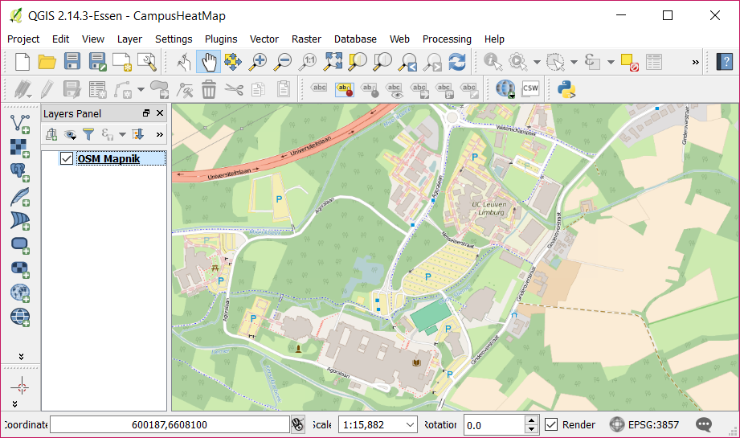

1.  Add a layer for the temperature measurements

  -   Go to Layer Create Layer New Shapefile Layer…

    

    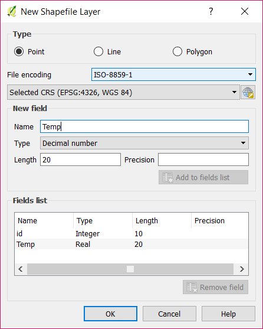

  -   Set the type of the new shapefile layer to Point (A).

  -   Add a new field Temp which type is Decimal number. Don’t forget to
    click on the button Add to fields list (B).

  -   Click on OK (C).

  -   Name the layer Measurements.

1.  Add points to the Measurements layer

  -   Right click on Measurements and select Toggle Editing.

  -   Click on the Add Feature button. Points will now be added when you
    click on the map.

  -   Place points to mark all locations where you have measured
    the temperature. You can add the temperature values directly, but
    other methods will be explained later.

    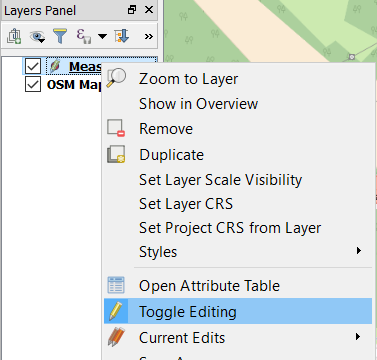 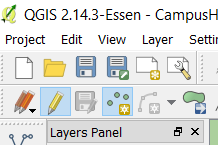

1.  Changing the properties of the layers within the project

  -   The checkboxes in front of the layers indicate whether a layer is
    visible or not.

  -   By changing the order of the layers you decide which layers are in
    the front and which will function as backgrounds.

  -   Make sure both layers are visible and Measurements is the top layer.

    

1.  Update Measurements with your own data

    This can be done in various ways:

    Option 1: Insert the data manually

  -   Right click on Measurements and select Toggle Editing (A).

  -   Right click on Measurements again and select Open Attribute
    Table (B).

    
    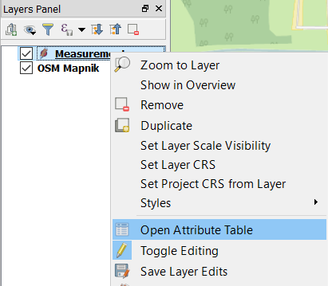

  -   Select each cell of the Temp field in the attribute table and fill
    in your obtained values.

  -   When you are done editing, select Toggle Editing again.

    Option 2: Import the data from a CSV file

  -   Delete the **Temp** field from the attribute table.

      -   Right click on **Measurements** and click on **Toggle Editing**.

      -   Right click on **Measurements** and open the **attribute
        table**.

      -   Click on the **Delete field** button **(A)**.

      -   Select **Temp** and click on **OK (B)**.

        
        

  -   Import your **CSV file** as a layer.

      -   Go to **Layer Add Layer Add Delimeted Text Layer... **

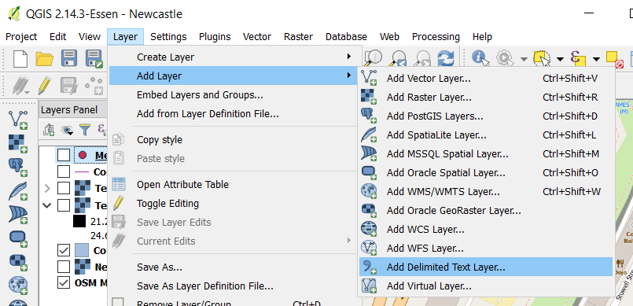

  -   Browse for the file **TEMP.CSV,** which was generated by your
    Arduino Weather Station, on your computer **(A)**.

  -   Name your layer **Temperatures** and select **CSV** as the file
    format **(B)**.

  -   Check the box **First record has field names** **(C)**.

  -   Check **No geometry (attribute only table)** **(D)**.

  -   Click on **OK** **(E)**.

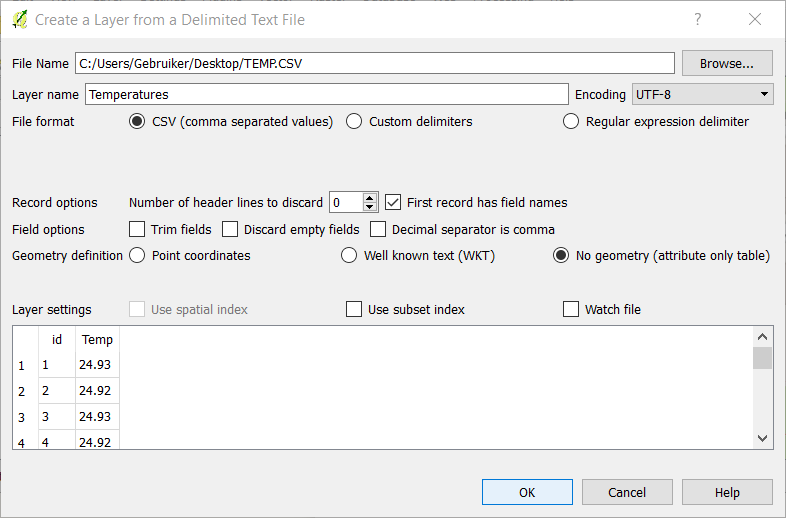

  -   Join the **Temperatures** layer with the **Measurements** layer.

      -   Right click on **Measurements** and select **Properties (A)**.

      -   Open the tab **Joins** and click on **Add** **(B)**.

        

        

      -   Set **Temperatures** as the **Join layer**. And **id** as the
        **Join field** and **Target field** **(A)**.

      -   Make sure the **Custom field name prefix** field is empty
        **(B)**.

      -   Click on **OK** **(C)**.

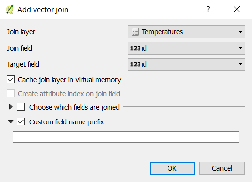

  -   Click on **OK** in the **Layer Properties** window.

1.  Change the visualization of the layer Measurements

  -   Right click on Measurements and select Properties.

  -   Click on Labels and select Temp as variable to label the data points
    with (A).

  -   Optionally, you can change the marker within the Style menu (B).

    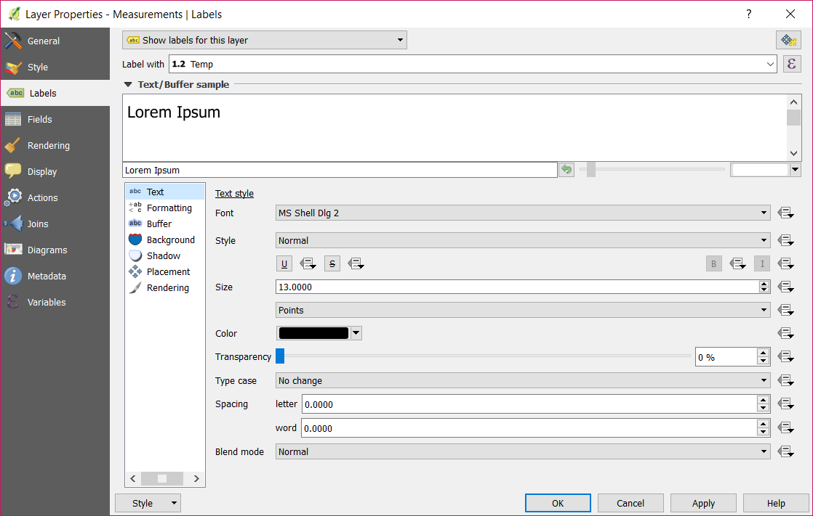

Interpolating Point Data
========================

1.  Open the Interpolation Plugin

  -   Go to Raster Interpolation Interpolation.

    

1.  Fill in the parameters within the Interpolation Plugin dialog

  -   Set Measurements as the input vector layer and Temp as the
    interpolation attribute (A).

  -   Click on Add (B).

  -   Within the output section, select Inverse Distance Weighting (IDW)
    as interpolation method (C).

  -   Fill in the other values as presented in the image below (D).

  -   Navigate to a folder to save the generated output file and name it
    temperature (E).

  -   Click on Ok (F).

    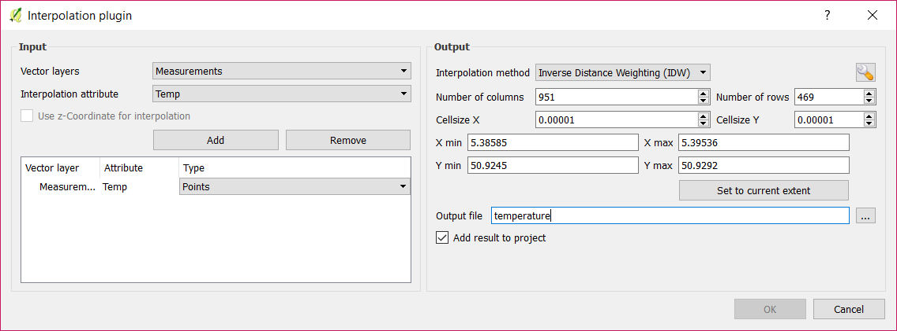

1.  Verify your result

  -   The generated output file is added as a layer within the project.

  -   To zoom in on the layer, right click on Temperature and select Zoom
    to Layer.

  -   Move the Measurements layer on top of Temperature.

    

Change the style of the (clipped) layer
========================================

1.  Adjust the color map

  -   Right click the Temperature layer and select Properties (A).

  -   Open the Style tab and set the render type to Singleband
    pseudocolor (B).

  -   Select Spectral color map (C).

  -   Check the Invert box, so that blue will be assigned to low
    temperatures and red to high temperatures (C).

  -   Click on Classify (D).

    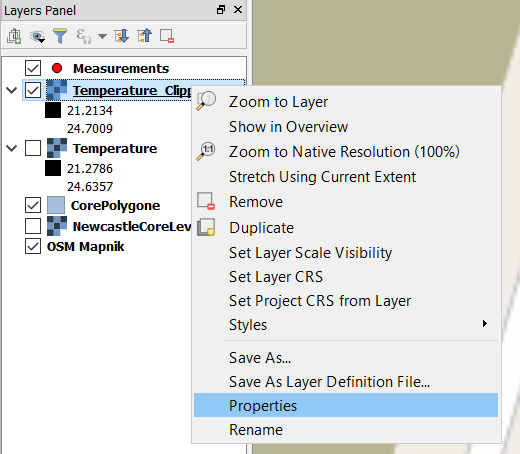

1.  Remove the black pixels from the output

  -   Open the Transparency tab.

  -   Set 0 as the additional no data value.

  -   Click on Ok.

  -   This results in a temperature relief map for the campus.

    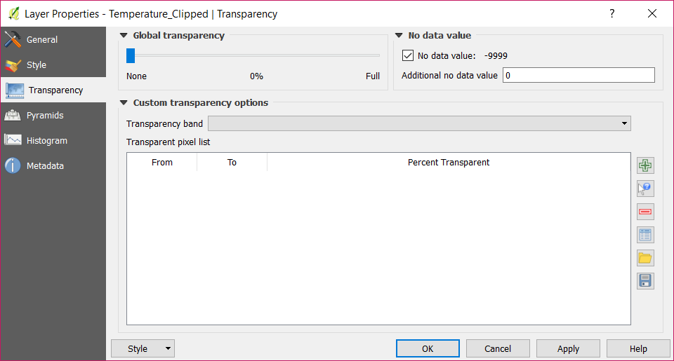

1.  \[Optional\] Generate contours lines

  -   Go to Raster Extraction Contour (A).

  -   Set the Temperature\_Clipped layer as the input file and name the
    output file Contours (B).

  -   Set the interval between contour lines as 0.5 or 1(C).

  -   Check the Attribute name box and set this to CTEMP (D).

  -   Click on OK (E).

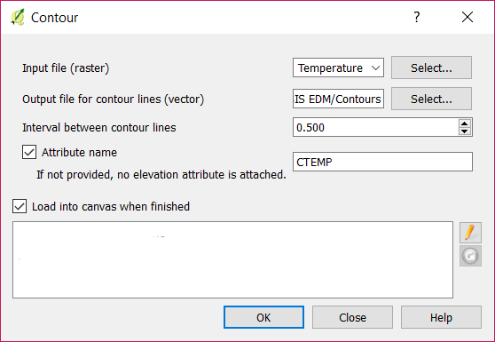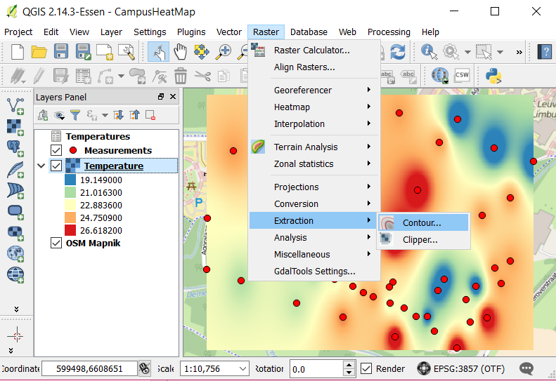

1.  Add labels to the contour lines

  -   Right click on the layer Contours and select Properties.

    

  -   Open the Labels tab (A).

  -   Select Show labels for this layer in the dropdown box (B).

  -   Set CTEMP as the value for Label with (C).

  -   Select Curved as Placement type (D).

  -   Click on OK (E).

    

1.  Verify the result

  -   The result should look like this:

    

Exporting the result
====================

1.  Create a new print composer

  -   Go to Project New Print Composer (A).

  -   Set HeatMap as the print composer title (B).

1.  Add the created heat map

  -   Click on the Add new map button (A).

  -   Draw a rectangle on the presented page (B).

    

  -   Click on the Move item content button (C).

  -   Click on the map and drag it until the heat map is centered within
    the rectangle.

  -   Set Scale to 6000 (D).

    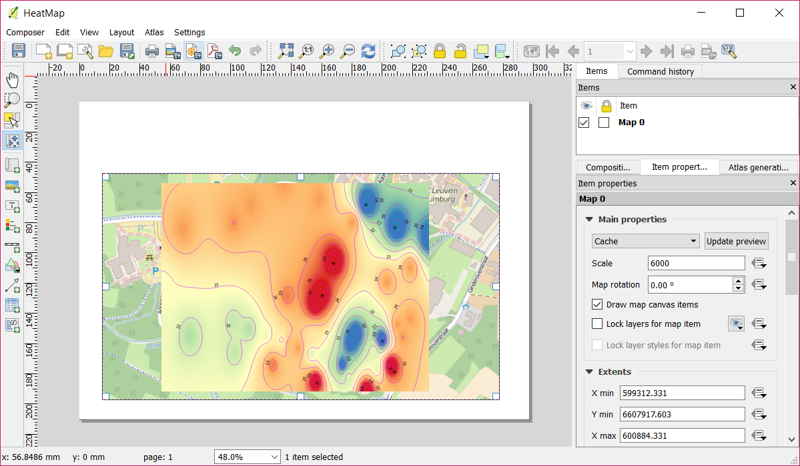

    

1.  Add a title to the page

  -   Click on the Add new label button (A).

  -   Draw a rectangle on the page (B).

  -   Set a title for the heat map (C).

  -   Choose a font for the title (D).

    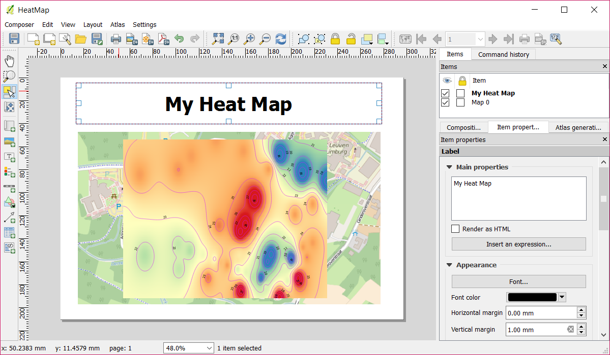

    

1.  Save your creation

  -  Go to Composer Export as PDF.
 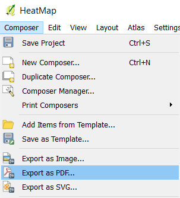
  -   Name your file MyHeatMap.pdf.
